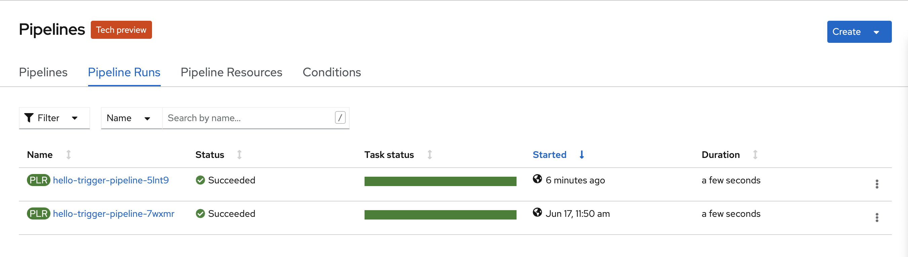

# Visão Geral


> Se estiver com pressa pode ir direto para a sessão : **[CLI - Passos](#CLI)** e executar os scripts. 
>
> Fonte das Imagens:
>
> * acima: https://developer.ibm.com/devpractices/devops/tutorials/tekton-triggers-101/
> * abaixo: https://medium.com/cloud-engagement-hub/tekton-a-way-through-the-labyrinth-episode-1-1688260c61e7

## 	


### UI

> A seguite temos os passos usados Web Console

#### Task


```yaml
apiVersion: tekton.dev/v1beta1
kind: Task
metadata:
  name: hello-trigger-task
  labels:
    app: hello-trigger
spec:
  params:
    - name: gitUrl
      description: the git url used
      type: string
    - name: gitAuthor
      description: who performed the commit
      type: string
    - name: gitCommit
      description: hash of the commit performed
      type: string
  steps:
    - name: event-url
      image: registry.redhat.io/ubi7/ubi-minimal
      command:
        - /bin/bash
        - '-c'
        - echo
        - "Git-URL: $(inputs.params.gitUrl)"
    - name: event-author
      image: registry.redhat.io/ubi7/ubi-minimal
      command:
        - /bin/bash
        - '-c'
        - echo
        - "Author: $(inputs.params.gitAuthor)"
    - name: event-commit
      image: registry.redhat.io/ubi7/ubi-minimal
      command:
        - /bin/bash
        - '-c'
        - echo
        - "Commit: $(inputs.params.gitCommit)"
```


#### Pipeline


> ciclar na task


#### TriggerBinding


```yaml
apiVersion: triggers.tekton.dev/v1alpha1
kind: TriggerBinding
metadata:
  name: custom-bitbucket-tb
  labels:
    app: hello-trigger
spec:
  params:
    - name: nickname
      value: $(body.actor.nickname)
    - name: hash
      value: '$(body.push.changes[0].commits[0].hash)'
    - name: url
      value: '$(body.push.changes[0].old.links.html.href)'
```


#### Trigger


##### EventListener: Gerado


###### Rota: Gerada


##### TriggerTemplate: Gerado


#### Testando

Não basta chamar diretamente a rota da triger gerada!

> Na parte superior temos o log dos eventos
>
> Na parte inferiror temos a chamada da rota


##### Commit a Change

> Executar **[Configurar Webhook no Bitbucket](#Bitbucket)**

Editar uma arquivo para disparar a trigger

> 1. Selecionar por exemplo o README.md
> 2. Editar e fazer alguma alteração


##### View log


```json
{
  "level": "info",
  "ts": "2021-06-17T14:50:34.582Z",
  "logger": "eventlistener",
  "caller": "sink/sink.go:236",
  "msg": "ResolvedParams : [{Name:nickname Value:Renato Felix} {Name:hash Value:5afc0dbd96e3ee448e326a15e61346c7de0382ee} {Name:url Value:https://bitbucket.org/rfelix80/simples/branch/master}]",
  "knative.dev/controller": "eventlistener",
  "/triggers-eventid": "264bd04c-fe27-4f16-a5aa-995b3b0ad9c9",
  "/trigger": ""
}
{
  "level": "info",
  "ts": "2021-06-17T14:50:34.585Z",
  "logger": "eventlistener",
  "caller": "resources/create.go:95",
  "msg": "Generating resource: kind: &APIResource{Name:pipelineruns,Namespaced:true,Kind:PipelineRun,Verbs:[delete deletecollection get list patch create update watch],ShortNames:[pr prs],SingularName:pipelinerun,Categories:[tekton tekton-pipelines],Group:tekton.dev,Version:v1beta1,StorageVersionHash:RcAKAgPYYoo=,}, name: hello-trigger-pipeline-",
  "knative.dev/controller": "eventlistener"
}
{
  "level": "info",
  "ts": "2021-06-17T14:50:34.585Z",
  "logger": "eventlistener",
  "caller": "resources/create.go:103",
  "msg": "For event ID \"264bd04c-fe27-4f16-a5aa-995b3b0ad9c9\" creating resource tekton.dev/v1beta1, Resource=pipelineruns",
  "knative.dev/controller": "eventlistener"
}
```

##### PipelineRun: Executada


> Foi executado, temos log, contudo <u>não</u> foi associado os valores...


### Debugando

> Executar: **[Baixar o Payload da requisição do Bitbucket](#Payload)**


```shell
# criar pasta temporária
$ mkdir bitbucket && cd $_

# nela deverá ter o arquivo request-payload.json
$ curl -d @request-payload.json  http://el-event-listener-pqlnqz-hello03-trigger.apps.cluster-4b93.4b93.sandbox858.opentlc.com/
{"eventListener":"event-listener-pqlnqz","namespace":"hello03-trigger","eventID":"027821d5-87db-4724-9e94-f839167af194"}
```

> veja que esta resolvendo os parâmetros e executando **PipelineRun**


> agora podemos replicar/debugar a aplicação sem precisar necessariamente fazer o `commit + push` no repositório.




> Entendo o motivo de não apresentar os dados da task.
>
> 1) Falta propagar os parâmetros do **TriggerTemplate** para o **Pipeline**


```yaml
spec:
  params:
    - name: nickname
    - name: hash
    - name: url
  resourcetemplates:
    - apiVersion: tekton.dev/v1beta1
      kind: PipelineRun
      metadata:
        annotations: {}
        generateName: hello-trigger-pipeline-
        labels:
          tekton.dev/pipeline: hello-trigger-pipeline
        namespace: hello03-trigger
      spec:
        params:
          - name: gitUrl
            value: $(tt.params.url)
          - name: gitAuthor
            value: $(tt.params.nickname)
          - name: gitCommit
            value: $(tt.params.hash)
        pipelineRef:
          name: hello-trigger-pipeline
        resources: []
        status: null
        workspaces: []
```


> 2) Falta propagar os parâmetros do **Pipeline** para a **Task**


```yaml
spec:
  params:
    - name: gitUrl
      type: string
    - name: gitAuthor
      type: string
    - name: gitCommit
      type: string
  tasks:
    - name: hello-trigger-task
      params:
        - name: gitUrl
          value: $(params.gitUrl)
        - name: gitAuthor
          value: $(params.gitAuthor)
        - name: gitCommit
          value: $(params.gitCommit)
      taskRef:
        kind: Task
        name: hello-trigger-task
```

> Corrigir a **Task**

```yaml
apiVersion: tekton.dev/v1beta1
kind: Task
metadata:
  name: hello-trigger-task
  labels:
    app: hello-trigger
spec:
  params:
    - name: gitUrl
      description: the git url used
      type: string
    - name: gitAuthor
      description: who performed the commit
      type: string
    - name: gitCommit
      description: hash of the commit performed
      type: string
  steps:
    - name: event-url
      image: registry.redhat.io/ubi7/ubi-minimal
      command:
        - echo
      args:
        - "Git-URL: $(inputs.params.gitUrl)"
    - name: event-author
      image: registry.redhat.io/ubi7/ubi-minimal
      command:
        - echo
      args:
        - "Author: $(inputs.params.gitAuthor)"
    - name: event-commit
      image: registry.redhat.io/ubi7/ubi-minimal
      command:
        - echo
      args:
        - "Commit: $(inputs.params.gitCommit)"
```


## Exportando Artefatos

#### Aplicando labels nos artefatos

```shell
# eventlistener
$ oc get el
NAME                    ADDRESS                                                                  AVAILABLE   REASON                     READY   REASON
event-listener-pqlnqz   http://el-event-listener-pqlnqz.hello03-trigger.svc.cluster.local:8080   True        MinimumReplicasAvailable
$ oc label eventlistener event-listener-pqlnqz app=hello-trigger

# service
$ oc get svc
NAME                       TYPE        CLUSTER-IP     EXTERNAL-IP   PORT(S)    AGE
el-event-listener-pqlnqz   ClusterIP   172.30.53.59   <none>        8080/TCP   3h22m
$ oc label svc el-event-listener-pqlnqz app=hello-trigger

# route
$ oc get route
NAME                       HOST/PORT                                                                                PATH   SERVICES                   PORT   TERMINATION   WILDCARD
el-event-listener-pqlnqz   el-event-listener-pqlnqz-hello03-trigger.apps.cluster-4b93.4b93.sandbox858.opentlc.com          el-event-listener-pqlnqz   8000                 None
$ oc label route el-event-listener-pqlnqz app=hello-trigger

# TemplateTrigger
$ oc get tt
NAME                                             AGE
trigger-template-hello-trigger-pipeline-ita1x2   3h17m
$ oc label tt trigger-template-hello-trigger-pipeline-ita1x2 app=hello-trigger

```

#### Exportar Yaml's

```shell
$ oc get task,pipelines,tb,el,svc,route,tt -L app=hello-trigger -o yaml > hello-trigger.yaml
```

##### Cleanup Yaml

```shell
# make a copy
$ cp hello-trigger.yaml hello-trigger-clean.yaml
# removing
$ yq eval 'del(.items[].metadata.creationTimestamp)' -i hello-trigger-clean.yaml
$ yq eval 'del(.items[].metadata.generation)' -i hello-trigger-clean.yaml
$ yq eval 'del(.items[].metadata.managedFields)' -i hello-trigger-clean.yaml
$ yq eval 'del(.items[].metadata.namespace)' -i hello-trigger-clean.yaml
$ yq eval 'del(.items[].metadata.ownerReferences)' -i hello-trigger-clean.yaml
$ yq eval 'del(.items[].metadata.resourceVersion)' -i hello-trigger-clean.yaml
$ yq eval 'del(.items[].metadata.selfLink)' -i hello-trigger-clean.yaml
$ yq eval 'del(.items[].metadata.uid)' -i hello-trigger-clean.yaml
$ yq eval 'del(.items[].status)' -i hello-trigger-clean.yaml
$ yq eval 'del(.items[].spec.clusterIP)' -i hello-trigger-clean.yaml
$ yq eval 'del(.items[].spec.clusterIPs)' -i hello-trigger-clean.yaml
$ yq eval 'del(.items[].spec.host)' -i hello-trigger-clean.yaml
$ yq eval 'del(.items[].spec.resourcetemplates[].metadata.namespace)' -i hello-trigger-clean.yaml
```

###### Replace de EventListener name to new one

```shell
# listar nomes
$ yq eval '(.items[].metadata.name)' hello-trigger-clean.yaml
hello-trigger-task
hello-trigger-pipeline
custom-bitbucket-tb
event-listener-pqlnqz
el-event-listener-pqlnqz
el-event-listener-pqlnqz
trigger-template-hello-trigger-pipeline-ita1x2

## ALTERAR EL
$ GLOBAL_EL_NAME=$(yq eval '(.items[].metadata.name | select(. == "event-listener-*")' hello-trigger-clean.yaml)
$ echo $GLOBAL_EL_NAME
event-listener-pqlnqz

$ sed -i '' "s/$GLOBAL_EL_NAME/event-listener-hello-trigger/g" ./hello-trigger-clean.yaml

$ yq eval '(.items[].metadata.name)' hello-trigger-clean.yaml
hello-trigger-task
hello-trigger-pipeline
custom-bitbucket-tb
event-listener-hello-trigger
el-event-listener-hello-trigger
el-event-listener-hello-trigger
trigger-template-hello-trigger-pipeline-ita1x2

## ALTERAR TT
$ LOCAL_TT_NAME=$(yq eval '(.items[].metadata.name | select(. == "trigger-template-*")' hello-trigger-clean.yaml)
$ echo $LOCAL_TT_NAME
trigger-template-hello-trigger-pipeline-ita1x2

$ sed -i '' "s/$LOCAL_TT_NAME/trigger-template-hello-trigger-pipeline/g" ./hello-trigger-clean.yaml

$ yq eval '(.items[].metadata.name)' hello-trigger-clean.yaml
hello-trigger-task
hello-trigger-pipeline
custom-bitbucket-tb
event-listener-hello-trigger
el-event-listener-hello-trigger
el-event-listener-hello-trigger
trigger-template-hello-trigger-pipeline
```


## CLI

> A seguir temos os passos para executar usando **bash**

```shell
$ oc new-project hello-trigger

# create the files
$ oc apply -f hello-trigger-clean.yaml
task.tekton.dev/hello-trigger-task created
pipeline.tekton.dev/hello-trigger-pipeline created
triggerbinding.triggers.tekton.dev/custom-bitbucket-tb created
eventlistener.triggers.tekton.dev/event-listener-hello-trigger created
service/el-event-listener-hello-trigger configured
route.route.openshift.io/el-event-listener-hello-trigger created
triggertemplate.triggers.tekton.dev/trigger-template-hello-trigger-pipeline created

# terminal 01: view logs
$ oc logs -l app=hello-trigger -f

# terminal 02: curl with payload the EventListener
$ curl -d @request-payload.json $(oc get route -l app=hello-trigger | awk 'FNR == 2 {print $2}')
{"eventListener":"event-listener-hello-trigger","namespace":"hello-trigger","eventID":"cdd2bcc4-95d6-4570-af3c-f9be06a958b1"}
```


# Apêndices

## Bitbucket

> A seguir temos os passos para configurar o Webhook no Bitbucket

### Página inicial


### Repository Settings


#### Webhooks


#### Add New webhook


View requests

> Habilitar o histórico de requisições
>
> `Request history collection: On`


## Payload

> A seguir temos os passos para baixar o Payload da requisição do Bitbucket

### View requests


### View details


### Show request body

```json
{
  "push": {
    "changes": [
      {
        "forced": false,
        "old": {
          "name": "master",
          "links": {
            "commits": {
              "href": "https://api.bitbucket.org/2.0/repositories/rfelix80/simples/commits/master"
            },
            "self": {
              "href": "https://api.bitbucket.org/2.0/repositories/rfelix80/simples/refs/branches/master"
            },
            "html": {
              "href": "https://bitbucket.org/rfelix80/simples/branch/master"
            }
          },
          "default_merge_strategy": "merge_commit",
          "merge_strategies": [
            "merge_commit",
            "squash",
            "fast_forward"
          ],
          "type": "branch",
          "target": {
            "rendered": {},
            "hash": "2859646c41af6235c7580693e030fb58f96ad327",
            "links": {
              "self": {
                "href": "https://api.bitbucket.org/2.0/repositories/rfelix80/simples/commit/2859646c41af6235c7580693e030fb58f96ad327"
              },
              "html": {
                "href": "https://bitbucket.org/rfelix80/simples/commits/2859646c41af6235c7580693e030fb58f96ad327"
              }
            },
            "author": {
              "raw": "Renato Alves Felix <renatofelix.redhat@gmail.com>",
              "type": "author",
              "user": {
                "display_name": "Renato Felix",
                "uuid": "{dd97e49b-3019-466d-a3fe-8ec28572b1dd}",
                "links": {
                  "self": {
                    "href": "https://api.bitbucket.org/2.0/users/%7Bdd97e49b-3019-466d-a3fe-8ec28572b1dd%7D"
                  },
                  "html": {
                    "href": "https://bitbucket.org/%7Bdd97e49b-3019-466d-a3fe-8ec28572b1dd%7D/"
                  },
                  "avatar": {
                    "href": "https://secure.gravatar.com/avatar/465a19127946cab23e52fe5c2d997d19?d=https%3A%2F%2Favatar-management--avatars.us-west-2.prod.public.atl-paas.net%2Finitials%2FRF-1.png"
                  }
                },
                "type": "user",
                "nickname": "renatofelixredhat",
                "account_id": "5a7e002131816d2a4d963255"
              }
            },
            "summary": {
              "raw": "empty commit\n",
              "markup": "markdown",
              "html": "<p>empty commit</p>",
              "type": "rendered"
            },
            "parents": [
              {
                "hash": "dda71a2611da48fed8404b2af420a76d96f04136",
                "type": "commit",
                "links": {
                  "self": {
                    "href": "https://api.bitbucket.org/2.0/repositories/rfelix80/simples/commit/dda71a2611da48fed8404b2af420a76d96f04136"
                  },
                  "html": {
                    "href": "https://bitbucket.org/rfelix80/simples/commits/dda71a2611da48fed8404b2af420a76d96f04136"
                  }
                }
              }
            ],
            "date": "2021-06-17T00:07:16+00:00",
            "message": "empty commit\n",
            "type": "commit",
            "properties": {}
          }
        },
        "links": {
          "commits": {
            "href": "https://api.bitbucket.org/2.0/repositories/rfelix80/simples/commits?include=5afc0dbd96e3ee448e326a15e61346c7de0382ee&exclude=2859646c41af6235c7580693e030fb58f96ad327"
          },
          "html": {
            "href": "https://bitbucket.org/rfelix80/simples/branches/compare/5afc0dbd96e3ee448e326a15e61346c7de0382ee..2859646c41af6235c7580693e030fb58f96ad327"
          },
          "diff": {
            "href": "https://api.bitbucket.org/2.0/repositories/rfelix80/simples/diff/5afc0dbd96e3ee448e326a15e61346c7de0382ee..2859646c41af6235c7580693e030fb58f96ad327"
          }
        },
        "created": false,
        "commits": [
          {
            "rendered": {},
            "hash": "5afc0dbd96e3ee448e326a15e61346c7de0382ee",
            "links": {
              "self": {
                "href": "https://api.bitbucket.org/2.0/repositories/rfelix80/simples/commit/5afc0dbd96e3ee448e326a15e61346c7de0382ee"
              },
              "comments": {
                "href": "https://api.bitbucket.org/2.0/repositories/rfelix80/simples/commit/5afc0dbd96e3ee448e326a15e61346c7de0382ee/comments"
              },
              "patch": {
                "href": "https://api.bitbucket.org/2.0/repositories/rfelix80/simples/patch/5afc0dbd96e3ee448e326a15e61346c7de0382ee"
              },
              "html": {
                "href": "https://bitbucket.org/rfelix80/simples/commits/5afc0dbd96e3ee448e326a15e61346c7de0382ee"
              },
              "diff": {
                "href": "https://api.bitbucket.org/2.0/repositories/rfelix80/simples/diff/5afc0dbd96e3ee448e326a15e61346c7de0382ee"
              },
              "approve": {
                "href": "https://api.bitbucket.org/2.0/repositories/rfelix80/simples/commit/5afc0dbd96e3ee448e326a15e61346c7de0382ee/approve"
              },
              "statuses": {
                "href": "https://api.bitbucket.org/2.0/repositories/rfelix80/simples/commit/5afc0dbd96e3ee448e326a15e61346c7de0382ee/statuses"
              }
            },
            "author": {
              "raw": "Renato Felix <rfelix@redhat.com>",
              "type": "author",
              "user": {
                "display_name": "Renato Felix",
                "uuid": "{56fb6e28-9185-4355-95a2-d5645f317916}",
                "links": {
                  "self": {
                    "href": "https://api.bitbucket.org/2.0/users/%7B56fb6e28-9185-4355-95a2-d5645f317916%7D"
                  },
                  "html": {
                    "href": "https://bitbucket.org/%7B56fb6e28-9185-4355-95a2-d5645f317916%7D/"
                  },
                  "avatar": {
                    "href": "https://secure.gravatar.com/avatar/2baae98720def79d0ea1ef783349fd9e?d=https%3A%2F%2Favatar-management--avatars.us-west-2.prod.public.atl-paas.net%2Finitials%2FRF-5.png"
                  }
                },
                "type": "user",
                "nickname": "Renato Felix",
                "account_id": "5de1273c8389de0cd334ff98"
              }
            },
            "summary": {
              "raw": "README.md edited online with Bitbucket",
              "markup": "markdown",
              "html": "<p>README.md edited online with Bitbucket</p>",
              "type": "rendered"
            },
            "parents": [
              {
                "hash": "2859646c41af6235c7580693e030fb58f96ad327",
                "type": "commit",
                "links": {
                  "self": {
                    "href": "https://api.bitbucket.org/2.0/repositories/rfelix80/simples/commit/2859646c41af6235c7580693e030fb58f96ad327"
                  },
                  "html": {
                    "href": "https://bitbucket.org/rfelix80/simples/commits/2859646c41af6235c7580693e030fb58f96ad327"
                  }
                }
              }
            ],
            "date": "2021-06-17T14:50:22+00:00",
            "message": "README.md edited online with Bitbucket",
            "type": "commit",
            "properties": {}
          }
        ],
        "truncated": false,
        "closed": false,
        "new": {
          "name": "master",
          "links": {
            "commits": {
              "href": "https://api.bitbucket.org/2.0/repositories/rfelix80/simples/commits/master"
            },
            "self": {
              "href": "https://api.bitbucket.org/2.0/repositories/rfelix80/simples/refs/branches/master"
            },
            "html": {
              "href": "https://bitbucket.org/rfelix80/simples/branch/master"
            }
          },
          "default_merge_strategy": "merge_commit",
          "merge_strategies": [
            "merge_commit",
            "squash",
            "fast_forward"
          ],
          "type": "branch",
          "target": {
            "rendered": {},
            "hash": "5afc0dbd96e3ee448e326a15e61346c7de0382ee",
            "links": {
              "self": {
                "href": "https://api.bitbucket.org/2.0/repositories/rfelix80/simples/commit/5afc0dbd96e3ee448e326a15e61346c7de0382ee"
              },
              "html": {
                "href": "https://bitbucket.org/rfelix80/simples/commits/5afc0dbd96e3ee448e326a15e61346c7de0382ee"
              }
            },
            "author": {
              "raw": "Renato Felix <rfelix@redhat.com>",
              "type": "author",
              "user": {
                "display_name": "Renato Felix",
                "uuid": "{56fb6e28-9185-4355-95a2-d5645f317916}",
                "links": {
                  "self": {
                    "href": "https://api.bitbucket.org/2.0/users/%7B56fb6e28-9185-4355-95a2-d5645f317916%7D"
                  },
                  "html": {
                    "href": "https://bitbucket.org/%7B56fb6e28-9185-4355-95a2-d5645f317916%7D/"
                  },
                  "avatar": {
                    "href": "https://secure.gravatar.com/avatar/2baae98720def79d0ea1ef783349fd9e?d=https%3A%2F%2Favatar-management--avatars.us-west-2.prod.public.atl-paas.net%2Finitials%2FRF-5.png"
                  }
                },
                "type": "user",
                "nickname": "Renato Felix",
                "account_id": "5de1273c8389de0cd334ff98"
              }
            },
            "summary": {
              "raw": "README.md edited online with Bitbucket",
              "markup": "markdown",
              "html": "<p>README.md edited online with Bitbucket</p>",
              "type": "rendered"
            },
            "parents": [
              {
                "hash": "2859646c41af6235c7580693e030fb58f96ad327",
                "type": "commit",
                "links": {
                  "self": {
                    "href": "https://api.bitbucket.org/2.0/repositories/rfelix80/simples/commit/2859646c41af6235c7580693e030fb58f96ad327"
                  },
                  "html": {
                    "href": "https://bitbucket.org/rfelix80/simples/commits/2859646c41af6235c7580693e030fb58f96ad327"
                  }
                }
              }
            ],
            "date": "2021-06-17T14:50:22+00:00",
            "message": "README.md edited online with Bitbucket",
            "type": "commit",
            "properties": {}
          }
        }
      }
    ]
  },
  "actor": {
    "display_name": "Renato Felix",
    "uuid": "{56fb6e28-9185-4355-95a2-d5645f317916}",
    "links": {
      "self": {
        "href": "https://api.bitbucket.org/2.0/users/%7B56fb6e28-9185-4355-95a2-d5645f317916%7D"
      },
      "html": {
        "href": "https://bitbucket.org/%7B56fb6e28-9185-4355-95a2-d5645f317916%7D/"
      },
      "avatar": {
        "href": "https://secure.gravatar.com/avatar/2baae98720def79d0ea1ef783349fd9e?d=https%3A%2F%2Favatar-management--avatars.us-west-2.prod.public.atl-paas.net%2Finitials%2FRF-5.png"
      }
    },
    "type": "user",
    "nickname": "Renato Felix",
    "account_id": "5de1273c8389de0cd334ff98"
  },
  "repository": {
    "scm": "git",
    "website": null,
    "uuid": "{cc1adacb-bb5d-4b25-86b8-7762ac9a0780}",
    "links": {
      "self": {
        "href": "https://api.bitbucket.org/2.0/repositories/rfelix80/simples"
      },
      "html": {
        "href": "https://bitbucket.org/rfelix80/simples"
      },
      "avatar": {
        "href": "https://bytebucket.org/ravatar/%7Bcc1adacb-bb5d-4b25-86b8-7762ac9a0780%7D?ts=default"
      }
    },
    "project": {
      "links": {
        "self": {
          "href": "https://api.bitbucket.org/2.0/workspaces/rfelix80/projects/HEL"
        },
        "html": {
          "href": "https://bitbucket.org/rfelix80/workspace/projects/HEL"
        },
        "avatar": {
          "href": "https://bitbucket.org/account/user/rfelix80/projects/HEL/avatar/32?ts=1623693734"
        }
      },
      "type": "project",
      "name": "hello",
      "key": "HEL",
      "uuid": "{844f88b1-97b2-4ba2-8b80-ee8fe03af0fa}"
    },
    "full_name": "rfelix80/simples",
    "owner": {
      "display_name": "Renato Felix",
      "uuid": "{56fb6e28-9185-4355-95a2-d5645f317916}",
      "links": {
        "self": {
          "href": "https://api.bitbucket.org/2.0/users/%7B56fb6e28-9185-4355-95a2-d5645f317916%7D"
        },
        "html": {
          "href": "https://bitbucket.org/%7B56fb6e28-9185-4355-95a2-d5645f317916%7D/"
        },
        "avatar": {
          "href": "https://secure.gravatar.com/avatar/2baae98720def79d0ea1ef783349fd9e?d=https%3A%2F%2Favatar-management--avatars.us-west-2.prod.public.atl-paas.net%2Finitials%2FRF-5.png"
        }
      },
      "type": "user",
      "nickname": "Renato Felix",
      "account_id": "5de1273c8389de0cd334ff98"
    },
    "workspace": {
      "slug": "rfelix80",
      "type": "workspace",
      "name": "Renato Felix",
      "links": {
        "self": {
          "href": "https://api.bitbucket.org/2.0/workspaces/rfelix80"
        },
        "html": {
          "href": "https://bitbucket.org/rfelix80/"
        },
        "avatar": {
          "href": "https://bitbucket.org/workspaces/rfelix80/avatar/?ts=1623693656"
        }
      },
      "uuid": "{56fb6e28-9185-4355-95a2-d5645f317916}"
    },
    "type": "repository",
    "is_private": true,
    "name": "simples"
  }
}
```

> baixar este arquivo para `request-payload.json`


## Conhecendo alias do CRDs do Red Hat Pipelines

```shell
$ oc api-resources --api-group='tekton.dev'
NAME                SHORTNAMES   APIGROUP     NAMESPACED   KIND
clustertasks                     tekton.dev   false        ClusterTask
conditions                       tekton.dev   true         Condition
pipelineresources                tekton.dev   true         PipelineResource
pipelineruns        pr,prs       tekton.dev   true         PipelineRun
pipelines                        tekton.dev   true         Pipeline
runs                             tekton.dev   true         Run
taskruns            tr,trs       tekton.dev   true         TaskRun
tasks                            tekton.dev   true         Task
$ oc api-resources --api-group='triggers.tekton.dev'
NAME                     SHORTNAMES   APIGROUP              NAMESPACED   KIND
clustertriggerbindings   ctb          triggers.tekton.dev   false        ClusterTriggerBinding
eventlisteners           el           triggers.tekton.dev   true         EventListener
triggerbindings          tb           triggers.tekton.dev   true         TriggerBinding
triggers                 tri          triggers.tekton.dev   true         Trigger
triggertemplates         tt           triggers.tekton.dev   true         TriggerTemplate
```


# Referências

* Documentação Tekton - https://tekton.dev/docs/pipelines/pipelines/
* Instalar YQ - https://mikefarah.gitbook.io/yq/#install
  * Documentação de como apagar - https://mikefarah.gitbook.io/yq/operators/delete
* Outas referencias Configurando Webhook
  * https://medium.com/@nikhilthomas1/cloud-native-cicd-on-openshift-with-openshift-pipelines-tektoncd-pipelines-part-3-github-1db6dd8e8ca7
  * https://dlorenc.medium.com/tekton-triggers-3aba132c6344
  * https://www.openshift.com/blog/guide-to-openshift-pipelines-part-6-triggering-pipeline-execution-from-github
* Tutorial - https://redhat-scholars.github.io/tekton-tutorial/tekton-tutorial/triggers.html

